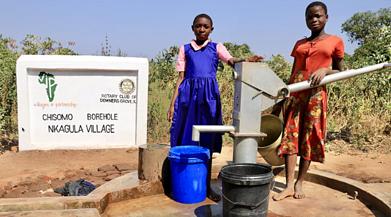
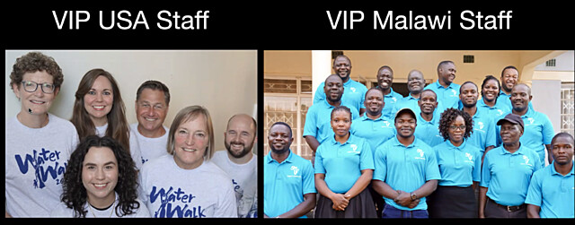
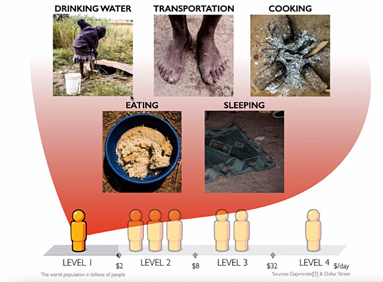
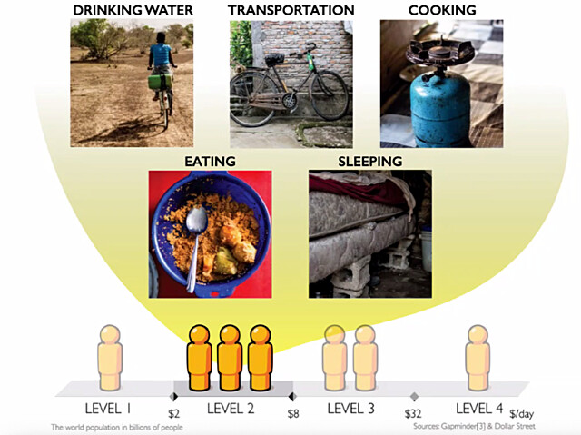
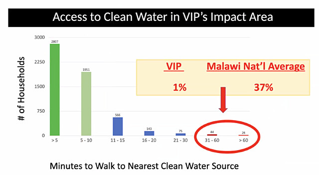

# Water for Malawi

  
  A completed well for Chisomo and Nkagula Villages

## [Why Malawi](https://villagesinpartnership.org/why-malawi/)

Malawi is consistently identified as one of the poorest countries in the world. While facing significant economic challenges, it has avoided the severe conflict and violence seen in other low-GDP countries.

Its resilient people suffer from a form of extreme poverty not seen anywhere in the U.S. The statistics are staggering and difficult to fathom. Many families, especially in our rural partner villages, eat only what food they are able to grow. With local government unable to provide any form of safety net, many Malawians live on a knife’s edge, with one bad harvest, one illness, or one accident often making the difference between life and death.

## Why [Villages In Partnership](https://villagesinpartnership.org)

Harry McCabe has been a Rotarian since 1978. Harry became aware of VIP's work through 
friendships in Christ Church of Oakbrook, and realized that their mission areas corresponded closely to Rotary's Seven Areas of Focus.  In 2021, Harry initiated a global water grant, [GG2122731](grants/gg2122731.md), in partnership with VIP and the Blantyre Rotary Club.

VIP concentrates on six Critical Resources: Water, Food Security, Education, Healthcare, Infrastructure, and Economic Opportunity.  They have six U.S. staff and 22 Malawi staff.

  
  VIP Staff

## Scarcity to Sustainability

VIP's mission is to empower communities in Malawi to rise from scarcity to sustainability by equipping them with the critical resources they need.

  
  Scarcity - Attributes of Level-1 Poverty

&nbsp;

  
  Sustainability - Attributes of Level-2 Poverty

## Expected Impact

### Clean, Close, Reliable Water Sources

For the current grant, [GG2688284](grants/gg2688284.md), VIP has identified five villages that face a shortfall of Malawi’s standard of one borehole serving 50 households, amounting to a gap of about seven boreholes.

- Manduwasa (460 ppl)
- Makuluni (635 ppl)
- Mmwala (1,405 ppl)
- Maulana (890 ppl)
- Maliwata (1,135 ppl)

This project will benefit about 1,000-1,250 people across the five new boreholes.  These people will no longer have to walk half an hour or more to fetch clean water.

  

### Economic and Social Justice

A nearby well can transform the social structure of a community for the
better, especially for women and girls.

Girls no longer have to spend large portions of their day fetching water and can go to school.

Women similarly can spend freed-up time engaging in economic opportunities more suited to their capabilities and goals.

## Why a Global Grant

Why don't we just give money directly to VIP instead of going to all the (considerable!) trouble of writing and executing a global grant from the Rotary Foundation?

1. The global grant process has the potential to unlock large amounts of matching funds, by seeking District Designated Funds (DDF) to fund the project.  All DDF given from Rotary clubs and districts is matched 80% by the World Fund.
2. Additionally, Rotary has a highly developed worldwide system for connecting networks of partners in doing good.
3. Finally, the global grant process includes built-in safeguards for protecting the integrity of Rotary and our partners.
